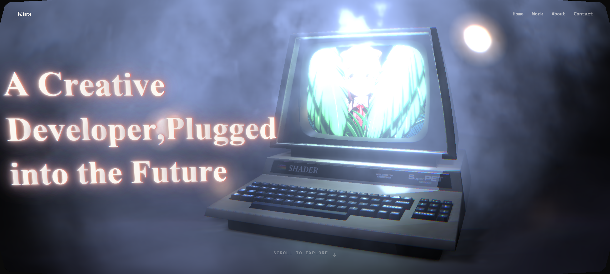
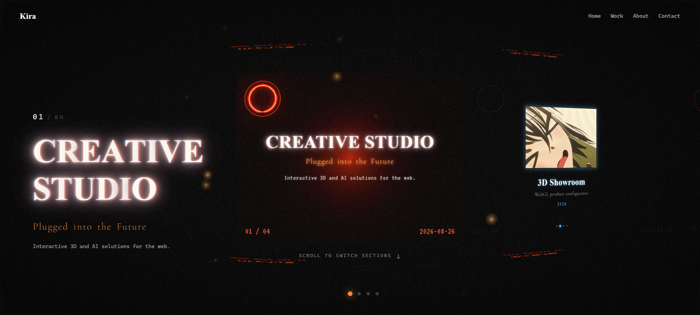
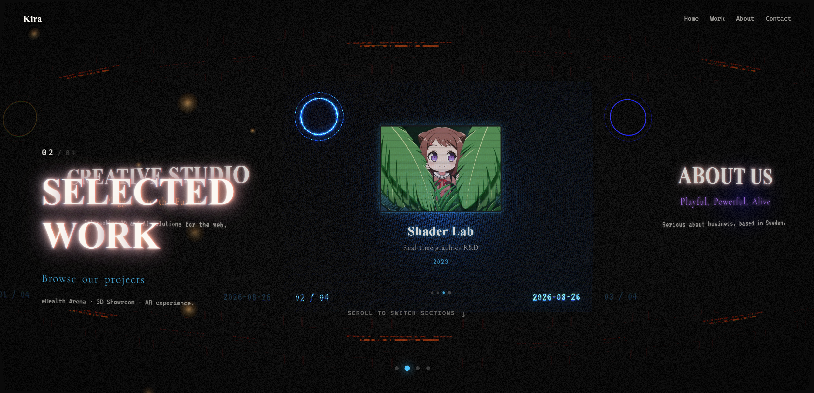
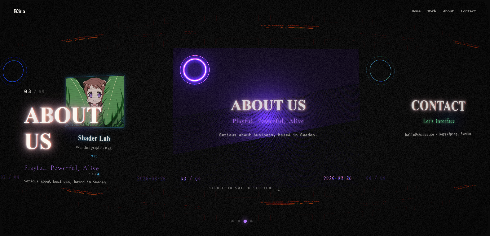
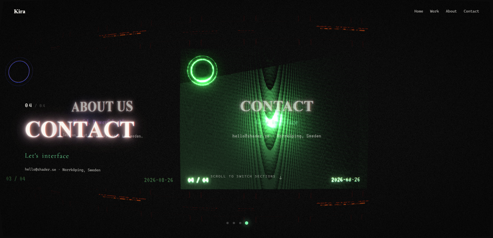
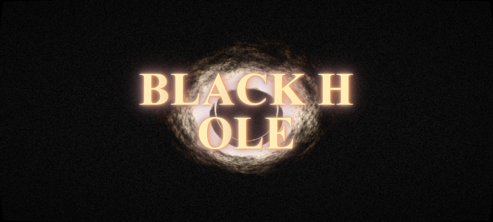
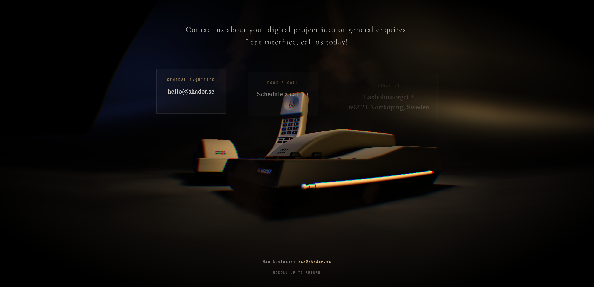
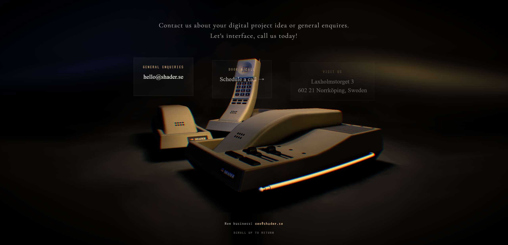
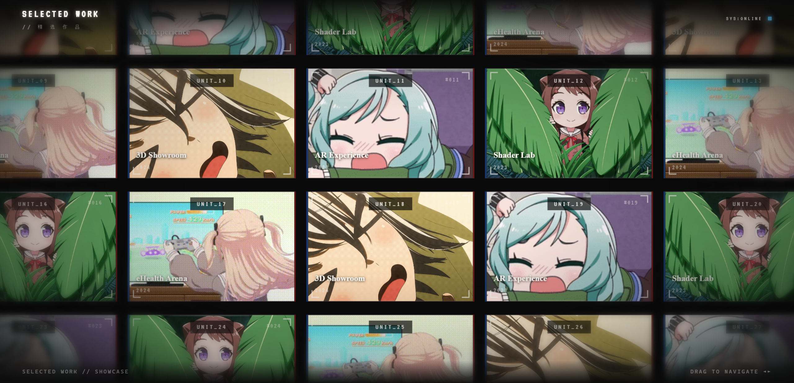
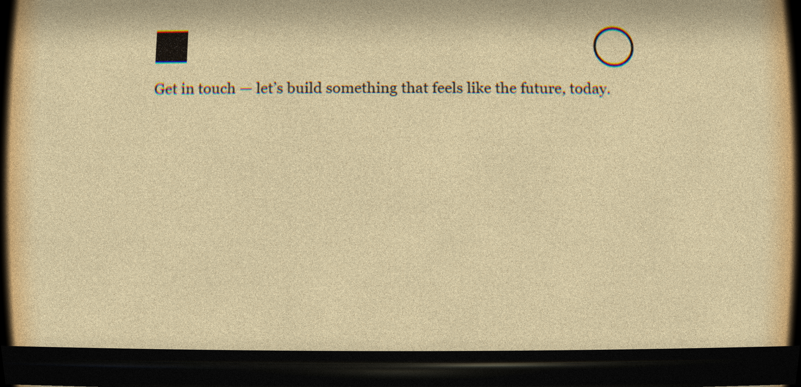

# Kira Shader

一个基于 **React 18 + React Three Fiber + Three.js** 构建的电影感 3D 交互作品集网站。项目参考 [shader.se](https://shader.se) 的视觉风格，通过**滚动驱动相机**、**GIF 屏幕纹理**、**自定义 GLSL 后处理**、**胶片卷曲场景**与**多详情页形态**，呈现"像拍电影一样浏览网页"的沉浸式体验。

>双入口架构：`#home`（电脑场景首屏）与 `#film`（电影胶片多场景版），两者通过 URL hash 无缝路由切换。



---

## ✨ 功能特性

- 🖥️ **双模式路由**：`http://localhost:5173`（默认电脑场景）/ `http://localhost:5173/#film`（胶片多场景），hash 变化自动重挂载对应 Demo。
- 🎬 **滚动驱动相机**：向下滚动时相机沿屏幕法线"推入屏幕内部"，末端白色闪光掩盖切换，进入 `#film` 后丝滑衔接。
- 🎞️ **35mm 电影胶片场景**：5 个 Section 依次水平排列，相机贴地推轨（dolly），鼠标横向拖拽即可在 Section 间滑动切换，支持触摸。
- 📺 **GIF 动态屏幕**：使用 `gifuct-js` 自行解析 4 个 GIF，每帧合成后写入 `CanvasTexture` 作为屏幕 `emissiveMap`，并让 `RectAreaLight` 实时采样 GIF 帧的平均颜色照亮周围环境（红屏照红光、蓝屏照蓝光）。
- ✨ **自定义 GLSL 后处理**：桶形鱼眼畸变 + 垂直方向色散 + 暗角 Vignette + 圆角矩形 SDF 遮罩 + 边缘羽化模糊 + UnrealBloom 辉光，全部在 `EffectComposer` 中实时渲染。
- 🌫️ **氛围粒子系统**：前后双层飘动烟雾（Sprite + 双频正弦扰动 + 透明度呼吸）与自发光尘埃粒子（`toneMapped=false` + AdditiveBlending）。
- 📄 **五个形态各异的详情页**：做旧纸张（GLSL Shader）、无限滑动作品柜（GSAP）、格子间办公场景、电话机联系页、实时光线步进黑洞（GLSL3 Ray March）——各自拥有独立的 3D Canvas 与滚动驱动相机。
- 🕳️ **实时光线步进黑洞**：移植自 C++/WebAssembly 独立项目的 `blackhole_main.frag`——引力透镜弯曲光线路径、体积噪声吸积盘（颜色贴图映射）、星云立方体天空盒背景，叠加 Bloom 辉光，悬停鼠标沿轨道环绕。
- 🖱️ **鼠标视差**：文字层 CSS 变量视差 + 3D 相机小角度跟随旋转，双通道响应。
- 🔤 **逐字浮现动画**：标题按字符拆分，配合递增 `transitionDelay` 逐字蹦出，滚动时逐字飞出消失。
- 🖼️ **复古加载屏**：`boot_screen.png` 全屏背景 + 10 格粗边框进度条（符合复古计算机风格）。

---

## 📸 界面预览

### 首页（#home）—— 电脑场景

电脑 3D 模型（Draco 压缩）、屏幕播放动态 GIF、暖色聚光灯、飘动烟雾与自发光尘埃环绕。入场动画从"屏幕特写"缓缓拉远到全景，滚动后相机扎进屏幕内部观看细节。


### 胶片场景（#film）—— 五 Section

访问 `/#film` 进入整体滚动叙事。每个 Section 拥有独立主色调与屏幕发光颜色。

| Section | 标题 | 主色 |
| --- | --- | --- |
| 01 | CREATIVE STUDIO · Plugged into the Future | `#ff8a3d` 橙 |
| 02 | SELECTED WORK · Browse our projects | `#4dc4ff` 蓝 |
| 03 | ABOUT US · Playful, Powerful, Alive | `#b678ff` 紫 |
| 04 | CONTACT · Let's interface | `#7dffae` 绿 |
| 05 | BLACK HOLE · Ray-Marched Reality | `#ffcc4d` 金 |









### 详情页（滚动到底进入）

每个 Section 滚到最底（progress > 0.92）会丝滑进入对应详情页；滚回顶部即可退出。

**BLACK HOLE 详情页** —— 移植自独立 C++/WebAssembly 项目的实时光线步进黑洞：引力透镜弯曲光线、体积噪声吸积盘（颜色贴图映射）、星云立方体天空盒背景，叠加 Bloom 辉光；悬停鼠标沿轨道环绕，滚动平滑拉近镜头，模拟向事件视界坠落。



**CONTACT 详情页** —— 相机从高空俯视"Hello."，向下滚动相机降至电话机水平，露出联系信息卡片（鱼眼 + 色散后处理随进度增强）。



**ABOUT US 详情页** —— 纯黑背景下 8 个面对面格子间，如剧场灯光般锐利聚光，滚动驱动相机降落至桌平线。



**SELECTED WORK 详情页** —— 4 行 × 7 列共 28 张项目卡片的**无限滑动展示柜**（移植自 ArikaShow），卡片越界即瞬移回绕形成无限循环，可任意方向拖拽。



**CREATIVE STUDIO 详情页** —— Canvas 2D 绘制的杂志式文字 → GLSL 着色器映射为做旧纸张质感，滚动驱动纸张上文字翻页，内容纹理随滚动平滑偏移（现代非对称排版 + 做旧特效）。



---

## 🧰 技术栈

| 分类 | 技术 |
| --- | --- |
| 框架 | React 18.3、TypeScript 5.6 |
| 3D 渲染 | Three.js 0.169、React Three Fiber 8.17、Drei 9.114 |
| 动画 | GSAP 3.15（无限滑动、缓动） |
| GIF 解析 | gifuct-js 2.1 |
| 构建 | Vite 5.4、@vitejs/plugin-react |
| 资源格式 | GLB（Draco 压缩）、GIF、PNG/WebP 纹理、WASM 解码器 |

---

## 📁 项目结构

```
kira_shader/
├── index.html                  # 入口 HTML（中文标题 "Kira Shader - 技术展示"）
├── package.json
├── vite.config.ts              # Vite 配置（端口 5173、publicDir）
├── tsconfig.json
├── public/
│   └── asset/
│       ├── models/             # GLB 模型（computer/bank/phones/tie/shredder 等）
│       ├── textures/           # 烟雾、灰尘、启动屏、项目 GIF 缩略图
│       ├── fonts/              # STIX 数学字体（JSON + PNG）
│       └── vendor/draco/       # Draco WASM 解码器
├── src/
│   ├── main.tsx                # 入口：按 URL hash 路由 App / KiraFilmDemo
│   ├── App.tsx                 # #home：电脑场景三层架构 + 滚动推入相机
│   ├── KiraFilmDemo.tsx        # #film：五 Section 滚动叙事 + 5 详情页调度
│   ├── styles.css              # 全部 UI 样式（加载屏/导航/胶片/详情页）
│   ├── assets/
│   │   ├── screen/             # 4 个屏幕 GIF（Vite 打包 hash）
│   │   └── textures/boot_screen.png
│   └── components/
│       ├── ComputerScene.tsx   # 电脑场景（模型/屏幕 GIF/烟雾/粒子/相机）
│       ├── PostProcessing.tsx  # 色散+鱼眼+暗角+圆角+Bloom 后处理
│       ├── FilmScene.tsx       # 胶片场景（FilmStrip/屏幕/尘埃/拖动切换）
│       ├── FilmPostProcessing.tsx / ContactPostProcessing.tsx
│       ├── PaperScene.tsx      # 做旧纸张 GLSL 着色器（滚动内容纹理偏移）
│       ├── BlackholeScene.tsx  # 实时光线步进黑洞 GLSL3 着色器（引力透镜+吸积盘）
│       ├── LoadingScreen.tsx   # 10 格复古进度条加载屏
│       └── NavBar.tsx          # 顶部导航
└── screenshots/                # 本文档使用的运行截图
```

---

## 🚀 快速开始

```bash
# 安装依赖
npm install

# 启动开发服务器（默认 http://localhost:5173 ）
npm run dev

# 生产构建（tsc 类型检查 + vite 打包）
npm run build

# 预览生产构建
npm run preview
```

打开浏览器访问：

- `http://localhost:5173` —— 电脑场景首屏（滚动 → 相机推入屏幕）
- `http://localhost:5173/#film` —— 胶片多场景（滚动推进 + 横向拖拽切换 Section，滚动到底进入详情页）

---

## 🎯 核心实现解析

### 1. 三层叠加架构

页面固定为三个纵向堆叠的层级（见 `App.tsx` / `KiraFilmDemo.tsx`）：

```
z-50  滚动容器（.scroll-container，含虚拟高度占位，捕获全部滚动）
z-45  内容覆盖层（.content-overlay，文字 UI，pointer-events 穿透）
z-40  WebGL Canvas（.canvas-wrapper，3D 内容，pointer-events: none）
```

滚动进度（0~1）通过 `ref + state` 双通道传入 3D 场景：高频数据（相机、粒子）用 `useFrame` 直接读 ref，避免重渲染；低频 UI 用 state。

### 2. 滚动驱动相机（ComputerScene）

- **入场动画**：加载完成后相机从"屏幕特写"（FOV 25°）缓动（ease-out cubic）拉远至全景（FOV 41°），只播一次。
- **滚动推入**：相机沿屏幕法线 `(-0.6, 0, 0.8)` 方向推进，终点位于屏幕背面 0.25 单位（FOV 增至 55° 产生广角拉伸感）；`pow(t, 1.6)` 缓动让推入前期慢后期加速，像"扎进屏幕"。
- **鼠标视差**：`mouseRef` 归一化坐标经 lerp 平滑后叠加到 yaw/pitch，深度推入时视差强度随 `(1 - scrollEase)` 衰减至 0。
- 所有相机动画使用 `delta` 时间步进，与帧率无关。

### 3. GIF 屏幕纹理（gifuct-js + CanvasTexture）

浏览器对 `` 的 GIF 有惰性解码，因此项目自己解析 GIF 二进制：

1. `fetch` → `parseGIF` → `decompressFrames` 解压每帧 patch；
2. 按 `disposalType`（0/1/2/3）在临时 canvas 上逐帧合成出完整 `ImageData` 列表；
3. 每帧 `useFrame` 按 elapsed time 计算帧索引，`putImageData` 到 512×512 主 canvas，再上传 `CanvasTexture`（`emissiveMap`，`toneMapped=false`）；
4. 4 个 GIF 播完一轮自动轮换；GIF 尺寸不同统一缩放绘制。

**实时面光源**：屏幕的 `RectAreaLight` 每帧从当前 GIF 帧的 `ImageData` 采样平均 RGB 与亮度，颜色/强度随屏幕内容变化——真正"以屏幕照亮环境"。

### 4. 自定义后处理 Shader（PostProcessing）

`EffectComposer` 渲染链：`RenderPass → UnrealBloomPass → 自定义 ShaderPass`（Bloom 必须先于色散，否则光晕会被拆分）。

自定义 Shader 实现：

- **桶形畸变**：`scale = 1 + r² × distortion`，中心不变形、边缘外凸（鱼眼），`border` 参数控制边缘缩放补偿；
- **垂直色散**：R/B 通道沿 Y 轴反向偏移，偏移量随距中心距离呈 `pow(dist, falloff)` 增长（`falloff=2` 时中心更干净）；
- **暗角**：径向 `smoothstep` 衰减；
- **圆角遮罩**：Inigo Quilez `roundedBoxSDF`，`d > 0` 区域 alpha 归零，模拟镜头边缘；
- **边缘羽化**：圆角内侧 `uEdgeBlur` 宽度内四方向采样加权混合。

所有参数（`chromaticAberration / lensDistortion / vignette / bloom` 等）通过 `PostFXParams` 输入，实参同步到 uniforms，不触发 React 重渲染。

### 5. 氛围粒子（SmokeLayer / GlowParticles）

- **烟雾**：Sprite + `AdditiveBlending` + `depthWrite=false`，每粒子双频正弦扰动位置 + 透明度呼吸，前后两层随相机朝向动态放置（前层在镜头与电脑间，后层在电脑背面）；
- **发光尘埃**：程序化 Canvas 径向渐变生成柔光圆点纹理，`toneMapped=false` 让颜色不被 tone mapping 压暗，呈现"萤火"质感。

### 6. 胶片场景与拖动切换（FilmScene）

- 35mm 胶片条由 `FilmStrip` 在 Canvas 2D 绘制纹理，两侧 Section 旋转 `±0.25 rad` 呈卷曲感；
- Section 索引由 `dragOffsetRef` 决定（`Math.round(-offset / 4)`），鼠标水平拖拽（阈值 5px、防误触）更新偏移，松手吸附到最近帧；滚动仅驱动相机 Z 轴推近；
- 切换瞬间屏幕白闪（flash 强度由距过渡中点距离计算），掩盖相机水平移动与内容跳变。

### 7. 五种详情页形态

| 详情页 | 技术方案 |
| --- | --- |
| 做旧纸张 | Canvas 2D 绘制杂志式排版 → CanvasTexture → `PaperScene` 顶点着色器直出 NDC，片元着色器映射纸张/墨水质感；滚动驱动 UV 偏移翻页（平滑 lerp 惯性滚动） |
| 无限滑动作品柜 | 移植 ArikaShow `photobox`：28 张卡片 GSAP 拖拽，越界瞬间 `mov_x/mov_y ±容器尺寸` 回绕形成无限循环，基准宽度 1440px 整体缩放适配 |
| 格子间办公 | 8 个面对面格子间（bank/trophy 等 GLB），纯黑背景 + 锐利聚光灯，独立滚动容器驱动相机从高空俯视降落至桌面 |
| 电话机联系 | `ContactScene` 独立 Canvas，滚动驱动相机从 y=18 降至电话机水平，`ContactPostProcessing` 鱼眼/色散随进度增强 |
| 光线步进黑洞 | 移植 `blackhole_main.frag`（GLSL3）：300 步 ray march + 角动量守恒近似引力透镜 + Simplex 3D 噪声吸积盘（color_map 颜色映射）+ 星云立方体天空盒 + **ACES Filmic tonemapping**（Narkowicz 曲线），`FilmPostProcessing` Bloom 辉光；滚动平滑缩放 fovScale 拉近镜头 |

每个详情页都用独立滚动容器 + wheel 拦截（`passive:false` + `preventDefault`）闭环滚动状态，滚到顶继续上滑才冒泡退出，并带滞回阈值避免边界抖动。

---

## ⚙️ 配置项

代码顶部集中了可调参数，无需改动业务逻辑即可调优：

| 位置 | 常量 | 说明 |
| --- | --- | --- |
| `ComputerScene.tsx` | `CAMERA_CONFIG` | 相机 yaw/pitch/height/distance/fov 与鼠标视差幅度 |
| `ComputerScene.tsx` | `INTRO_CONFIG` | 入场动画起始距离 / FOV / 时长 |
| `ComputerScene.tsx` | `SCROLL_PUSH_CONFIG` | 滚动推入终点偏移 / 终点 FOV / 缓动指数 |
| `ComputerScene.tsx` | `SCREEN_CONFIG` | 屏幕位置/尺寸/朝向 / emissive 强度 / RectAreaLight 参数 |
| `ComputerScene.tsx` | `DEBUG` | 置 `true` 启用 OrbitControls 自检相机（发布前务必设回 `false`） |
| `App.tsx` | `postFXParams` | 首页后处理参数（色散/鱼眼/暗角/Bloom） |
| `FilmScene.tsx` | `SECTIONS / PROJECTS` | 五个 Section 的文案、主色与作品数据 |
| `BlackholeScene.tsx` | `BLACKHOLE_FRAG` + uniforms | 黑洞着色器主体；`adisk*` 系吸积盘参数（亮度/密度/噪声 LOD/旋转）、`gravatationalLensing/renderBlackHole` 开关、`fovScale` 基础视场 |
| `BlackholeDetailPage` | `blackholeFilmParams` | 黑洞页 Bloom：强度 0.3 / 阈值 0.85 / 半径 0.4（精致光晕，避免吸积盘过曝） |

---

## 🗺️ 路线图（可选）

- [ ] 移动端触控适配优化（当前胶片拖动已支持 touch，详情页待精调）
- [ ] 性能预算面板 / Inspector 工具（可基于 three-stdlib）
- [ ] 国际化文案（目前中英混排）

---

## 📄 License

本项目为个人技术展示项目，参考 [shader.se](https://shader.se) 的视觉与交互风格；模型、字体等资源版权归原作者所有，请勿用于商业用途。